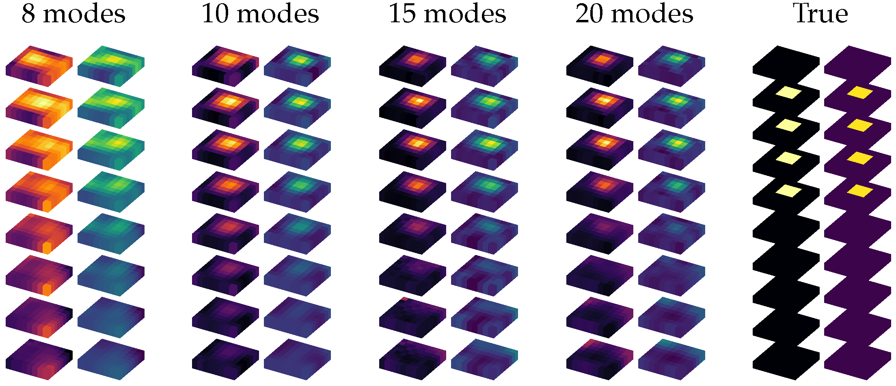
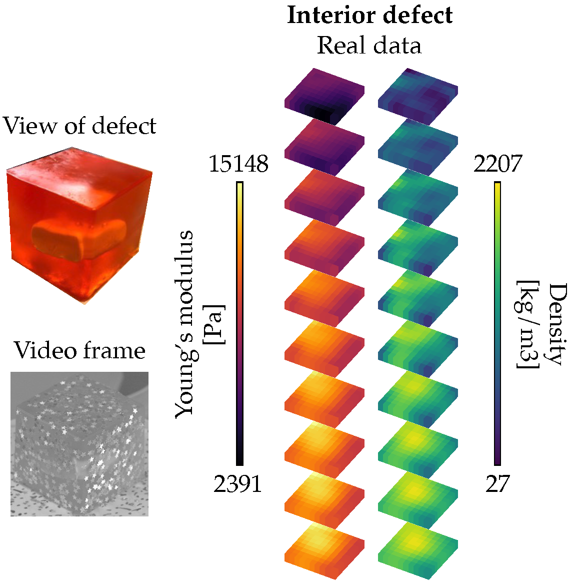

# Visual Vibration Tomography
[Project Page](http://imaging.cms.caltech.edu/vvt/) | [PDF](https://arxiv.org/pdf/2104.02735.pdf)

Berthy T. Feng, Alexander C. Ogren, Chiara Daraio, Katherine L. Bouman. "Visual Vibration Tomography: Estimating Interior Material Properties from Monocular Video." In Proceedings of the IEEE/CVF Conference on Computer Vision and Pattern Recognition (CVPR), 2022 (**Oral**).

## Setup
The codebase is written in Python and doesn't require many special packages, except the Python wrapper for `FEniCS` known as `DOLFIN`.
### Create Conda environment
```
$ conda update conda
$ conda create -n vvt python=3.7
$ conda activate vvt
$ conda config --add channels conda-forge
$ conda config --add channels anaconda
```

### Install requirements
Note that Conda's environment solving step could take a while.
```
$ conda install --file requirements.txt
$ pip install pyrtools
```

## Demos
### Demo: simulated cube
The notebook `demo1_simulated_cube.ipynb` walks through end-to-end estimation
from an input video. Please download [simulated cube data](https://caltech.box.com/s/j6dhsgeuqe89g4fz7qz8aggaag5r4psl) and place them in the `simulated_data` folder. The demo specifically works with `defect03`.

<p align='center'>
    
</p>
<p align='center'>(Paper Fig. 4) Reconstruction of "defect03" as number of input modes increases.</p>


### Demo: real/damped cube

A damped cube typically requires modal observations from multiple videos. 
As such, we split the process into two notebooks:
1. `demo2.1_real_cube_mode_extraction.ipynb` walks through motion and image-space mode
extraction from one video. The notebook can be repeatedly run for multiple videos
of the same object, saving modal observations from each one.
2. `demo2.2_real_cube_inference.ipynb` takes the modal observations from multiple
videos and averages them to solve for material properties.

Please download the real [Jello cube data](https://caltech.box.com/s/ii4qejdnypagmg18pbi2usk1i4hky41c) and place them in the `real_data` folder. Modal observations from all three videos are already provided, so you can skip step (1).

<p align='center'>
    
</p>
<p align='center'>(Paper Fig. 11) Reconstructed material properties.</p>

## Simulated Dataset
The [simulated dataset](https://caltech.box.com/s/j6dhsgeuqe89g4fz7qz8aggaag5r4psl) 
contains 12 different defect cubes. `defect01-defect12` 
are the undamped versions, and `damped_defect01-damped_defect12` are the damped
versions. Additionally, `defect_center` is an undamped cube with a perfectly-centered
defect.

The data for each object is stored in a folder (e.g., `simulated_data/defect01`)
that contains the following files:
* `true_stiffness.npy`, `true_density.npy`: The true material properties used in
the forward model. The forward model is a 10x10x10 hexahedral mesh, so each 
file is a 1D NumPy array containing the voxel-wise material-property values.
* `{initial_condition}/transient.mat`: The COMSOL transient analysis results
for a particular initial condition. This file is used to create the animated
video, `{initial_condition}/transient.gif`. Since the undamped cubes have sufficient
modal expression from one initial condition, only the `top_front_pluck` transient
analysis results are included. The damped cubes may need modal information from
multiple videos, so the transient analysis results of 5 initial conditions are 
provided: `top_front_pluck`, `top_back_pluck`, `top_right_pluck`, `top_left_pluck`,
`top_right_twist`.
* `modal.mat`: The COMSOL modal analysis results. This file is not used in
material-property estimation, but can be used to check
the true full-field modes of the object.

An animated video takes up a lot of storage (~1.2 GB), so we provide a
limited number of pre-written videos, specifically for: `defect_03`, `defect_08`, and `damped_defect_03`.

## Animation Script
To make an animated video from COMSOL transient analysis results, run
```
$ python make_comsol_animation.py {OBJ_NAME} {SIM_NAME}
```
where `OBJ_NAME` is the cube sample (e.g., "defect_01"), and `SIM_NAME` is the transient-analysis name (e.g., "top_front_pluck"). The script writes a GIF named `transient.gif` in the same folder that contains the `transient.mat` file. To speed up motion extraction, you can crop the GIF frames tightly to the cube.

## Notes
The easiest results to reproduce with this repo are reconstructions for `simulated_data/defect_03` and `real_data/jello_cube`. The paper includes figures for additional cases, including damped cubes and simulated/real drums.

### Damped cubes
The best way to work with damped cubes (e.g., `simulated_data/damped_defect01`) is to follow the process for the real Jello cube, i.e., with `demo2.1_real_cube_mode_extraction.ipynb` and `demo2.2_real_cube_inference.ipynb`. The video names and FPS will have to be specified accordingly, and the modal observations require some amount of qualitative hand-selection.

### Drums
For clarity, we only provide code for working with cubes. Please contact bfeng@caltech.edu if you would like code for working with drums or other geometries.